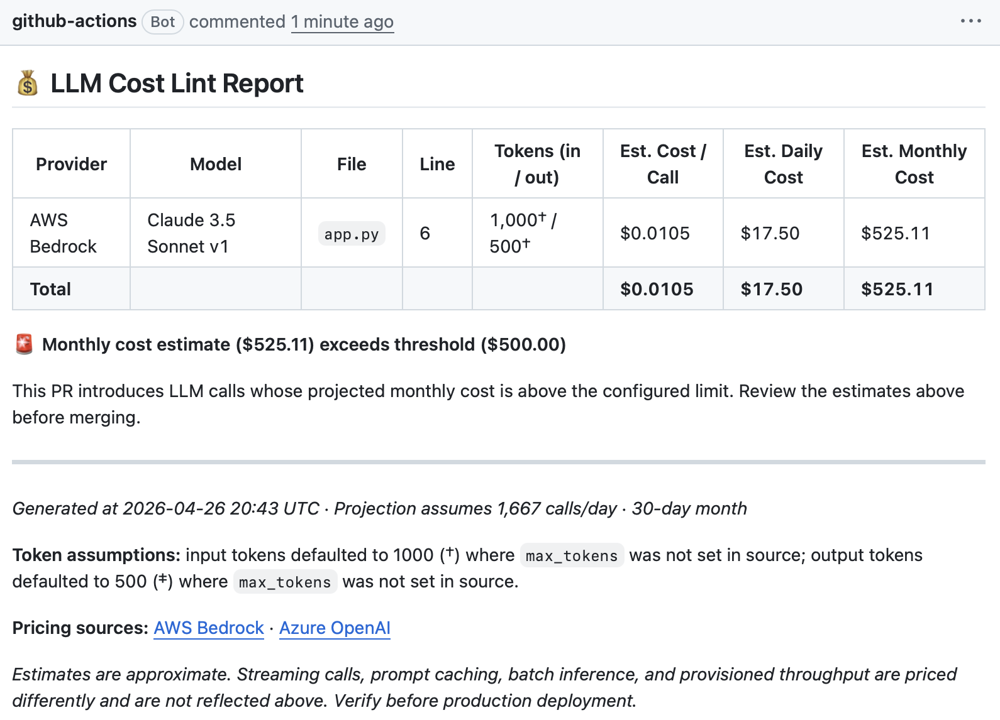

# llm-cost-lint

[](https://github.com/salilborkar/llm-cost-lint/actions/workflows/llm-cost-check.yml)
[](LICENSE)
[](https://github.com/salilborkar/llm-cost-lint/stargazers)

A GitHub Action that scans Python files for AWS Bedrock and Azure OpenAI API calls and posts a cost estimate to your PR before the code ships.

---

## Why this exists

Teams regularly merge LLM API calls without knowing what they'll cost at scale — a prompt that looks cheap in development can run into hundreds of dollars a month once real traffic hits it. `llm-cost-lint` catches that at PR review time, when there's still an opportunity to reconsider the model, reduce max_tokens, or question the call frequency — not when the AWS bill arrives.

---

## What it looks like

When your PR touches a file that contains LLM API calls, 'llm-cost-lint' action posts a comment with a detailed breakdown, like this:



See it live in the  [demo repo](https://github.com/salilborkar/llm-cost-lint-demo/pull/2).

---

## Quick start

**Step 1 — Copy the workflow into your repo**

```bash
mkdir -p .github/workflows
curl -o .github/workflows/llm-cost-check.yml \
  https://raw.githubusercontent.com/salilborkar/llm-cost-lint/v1/.github/workflows/llm-cost-check.yml
```

**Step 2 — Add the required permissions**

The action posts the cost report as a PR comment, which requires write access to pull requests. Add the following block to your workflow file at the top level (before `jobs:`):

```yaml
permissions:
  contents: read
  pull-requests: write
```

Without `pull-requests: write`, the GitHub API call to post the comment will return a 403 and the action will log a warning, but the workflow step itself will still pass.

**Step 3 — Set your cost threshold**

Open `.github/workflows/llm-cost-check.yml` and adjust `cost-threshold` to a monthly USD value that makes sense for your project. Set `fail-on-threshold: 'true'` if you want to block merges that exceed it.

**Step 4 — Open a PR**

The action runs automatically on every PR. If your PR touches Python files that contain Bedrock or Azure OpenAI calls, a cost report will be posted as a PR comment.

---

## Configuration

| Input | Default | Description |
|---|---|---|
| `path` | `.` | Directory or file to scan. Scanned recursively for `.py` files. |
| `monthly-calls` | `30000` | Estimated number of times each detected LLM call runs per month in production. |
| `default-input-tokens` | `1000` | Input token count assumed when prompt size can't be inferred from source. |
| `default-output-tokens` | `500` | Output token count assumed when `max_tokens` isn't set in the call. |
| `cost-threshold` | `100` | Monthly cost ceiling in USD. A warning is added to the report when exceeded. Set to `0` to disable. |
| `fail-on-threshold` | `false` | Set to `true` to exit with code 1 when `cost-threshold` is exceeded, blocking the merge. |
| `post-pr-comment` | `true` | Post the cost report as a comment on the pull request. Requires `pull-requests: write` permission. |
| `github-token` | `${{ github.token }}` | GitHub token used to post PR comments. Defaults to the workflow's automatic `GITHUB_TOKEN`. |

---

## Supported models

Pricing last verified **2026-04-20**. Source files: [AWS Bedrock pricing](https://aws.amazon.com/bedrock/pricing/) · [Azure OpenAI pricing](https://azure.microsoft.com/en-us/pricing/details/cognitive-services/openai-service/)

### AWS Bedrock

| Model ID | Display Name | Input (per 1K tokens) | Output (per 1K tokens) |
|---|---|---|---|
| `anthropic.claude-3-5-sonnet-20241022-v2:0` | Claude 3.5 Sonnet v2 | $0.006 | $0.030 |
| `anthropic.claude-3-haiku-20240307-v1:0` | Claude 3 Haiku | $0.00025 | $0.00125 |
| `amazon.titan-text-express-v1` | Titan Text Express | $0.0002 | $0.0006 |

### Azure OpenAI

Global deployment pricing. Regional/Data Zone deployments cost approximately 10% more.

| Model ID | Display Name | Input (per 1K tokens) | Output (per 1K tokens) |
|---|---|---|---|
| `gpt-4o-2024-11-20` | GPT-4o (2024-11-20, Global) | $0.0025 | $0.010 |
| `gpt-4o-mini-2024-07-18` | GPT-4o Mini (2024-07-18, Global) | $0.00015 | $0.0006 |

To add a model, open a PR updating `config/pricing.yml` with the new entry.

---

## Known limitations

**Token counts are estimates, not invoices.** Input tokens fall back to 
`default-input-tokens` when prompt size can't be inferred from source — real 
prompts with system messages, conversation history, or few-shot examples can 
be 5–20x larger. Output tokens use `max_tokens` as a ceiling, but most calls 
return shorter responses. Treat the report as a directional cost check, not a 
billing prediction.

**Batch and cached inputs are not yet detected.** AWS Bedrock Batch Inference 
and prompt caching can reduce real cost by 50–90% vs. on-demand. The action 
prices everything at full on-demand rates, so projections will overstate cost 
for batch- or cache-heavy workloads.

**Regional and Data Zone deployments cost more.** Pricing is based on Azure 
OpenAI Global rates. Regional or Data Zone deployments are roughly 10% higher.

**Pricing is hardcoded.** When AWS or Azure update their rates, 
`config/pricing.yml` must be updated manually. Open a PR if you spot stale 
pricing — the file header lists source URLs.

---

## Roadmap

**v2 intentions**

- **Google Vertex AI support** — detect `vertexai` and `google-cloud-aiplatform` SDK calls, add Gemini model pricing.
- **Batch API detection** — detect AWS Bedrock Batch Inference and Azure OpenAI batch deployment calls, apply the correct (lower) pricing tier.
- **Cached input token pricing** — add a `cache-hit-rate` input and apply the reduced input cost when prompt caching is enabled.
- **Auto-pricing updates** — a scheduled workflow that checks provider pricing pages and opens a PR to update `config/pricing.yml` when rates change.

---

## Contributing

Issues and PRs welcome. When updating model pricing, include a link to the provider's pricing page in your PR description so the change can be verified.

## License

[MIT](LICENSE)

## Pricing sources

- AWS Bedrock: https://aws.amazon.com/bedrock/pricing/
- Azure OpenAI: https://azure.microsoft.com/en-us/pricing/details/cognitive-services/openai-service/
